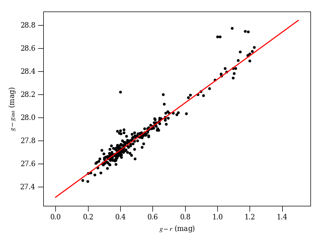
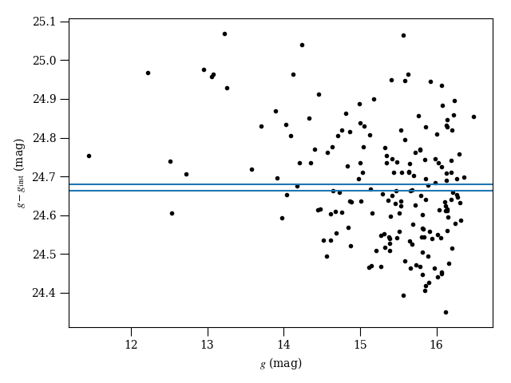

# calviacat
Calibrate star photometry by comparison to a catalog.  PanSTARRS 1 catalog currently supported.

## Requirements

* sqlite3
* requests
* astropy

## Examples

Calibrate a Las Cumbres Observatory images of 41P/Tuttle-Giacobini-Kresak.

## PanSTARRS catalog with color correction

``` python
import os
import requests
import numpy as np
import matplotlib.pyplot as plt
from astropy.table import Table
from astropy.io import fits
from astropy.coordinates import SkyCoord
import calviacat as cvc

if os.path.exists('lco.fits'):
    hdu = fits.open('lco.fits')
else:
    r = requests.get('https://archive-api.lco.global/frames/6143031/').json()
    hdu = fits.open(r['url'])
    hdu.writeto('lco.fits')

im = hdu['sci'].data
h = hdu['sci'].header
phot = Table(hdu['cat'].data)

phot = phot[phot['FLAG'] == 0]  # clean LCO catalog
lco = SkyCoord(phot['RA'], phot['DEC'], unit='deg')

# initialize catalog
ps1 = cvc.PanSTARRS1('cat.db')

# download PS1 catalog?
if len(ps1.search(lco)[0]) < 500:
    ps1.fetch_field(lco)

# crossmatch LCO photometry table with catalog
objids, distances = ps1.xmatch(lco)

# Calibrate this g-band image, include a color correction
g_inst = -2.5 * np.log10(phot['FLUX'])
g_err = phot['FLUXERR'] / phot['FLUX'] * 1.0857

zp, C, unc, g, gmr = ps1.cal_color(objids, g_inst, 'g', 'g-r')

# plot results
fig = plt.figure(1)
fig.clear()
ax = fig.gca()
ax.scatter(gmr, g - g_inst, marker='.', color='k')
x = np.linspace(0, 1.5)
ax.plot(x, C * x + zp, 'r-')
plt.setp(ax, xlabel='$g-r$ (mag)', ylabel='$g$ (mag)')
plt.tight_layout()

```




## SkyMapper catalog without color correction

No r-band coverage in DR1 for this image, so just calibrate to g without a color correction.

``` python
import os
import requests
import numpy as np
import matplotlib.pyplot as plt
from astropy.table import Table
from astropy.io import fits
from astropy.coordinates import SkyCoord
import calviacat as cvc

if os.path.exists('lco.fits'):
    hdu = fits.open('lco.fits')
else:
    r = requests.get('https://archive-api.lco.global/frames/6913550/').json()
    hdu = fits.open(r['url'])
    hdu.writeto('lco.fits')

im = hdu['sci'].data
h = hdu['sci'].header
phot = Table(hdu['cat'].data)

phot = phot[phot['FLAG'] == 0]  # clean LCO catalog
lco = SkyCoord(phot['RA'], phot['DEC'], unit='deg')

# initialize catalog
skym = cvc.SkyMapper('cat.db')

try:
    n = len(skym.search(lco)[0])
except ValueError:
    skym.fetch_field(lco)


# crossmatch LCO photometry table with catalog
objids, distances = skym.xmatch(lco)

# Calibrate this g-band image, include a color correction
g_inst = -2.5 * np.log10(phot['FLUX'])
g_err = phot['FLUXERR'] / phot['FLUX'] * 1.0857

zp_mean, zp_median, unc, g = skym.cal_constant(objids, g_inst, 'g')

# plot results
fig = plt.figure(1)
fig.clear()
ax = fig.gca()
ax.scatter(g, g - g_inst, marker='.', color='k')
ax.axhline(zp_mean)
ax.axhline(zp_median)
plt.setp(ax, xlabel='$g$ (mag)', ylabel=r'$g - g_{\rm inst}$ (mag)')
plt.tight_layout()

```



## Acknowledgements

Development of this code was supported by the NASA Solar System Observations program, grant NNX15AD99G.

The PS1 archive used by calviacat is hosted at STScI.  Please cite Chambers et al. 2016 (https://ui.adsabs.harvard.edu/#abs/arXiv:1612.05560) and acknowledge the Pan-STARRS 1 survey, as needed.  See https://panstarrs.stsci.edu/ for details.

The Pan-STARRS1 Surveys (PS1) and the PS1 public science archive have been made possible through contributions by the Institute for Astronomy, the University of Hawaii, the Pan-STARRS Project Office, the Max-Planck Society and its participating institutes, the Max Planck Institute for Astronomy, Heidelberg and the Max Planck Institute for Extraterrestrial Physics, Garching, The Johns Hopkins University, Durham University, the University of Edinburgh, the Queen's University Belfast, the Harvard-Smithsonian Center for Astrophysics, the Las Cumbres Observatory Global Telescope Network Incorporated, the National Central University of Taiwan, the Space Telescope Science Institute, the National Aeronautics and Space Administration under Grant No. NNX08AR22G issued through the Planetary Science Division of the NASA Science Mission Directorate, the National Science Foundation Grant No. AST-1238877, the University of Maryland, Eotvos Lorand University (ELTE), the Los Alamos National Laboratory, and the Gordon and Betty Moore Foundation.
