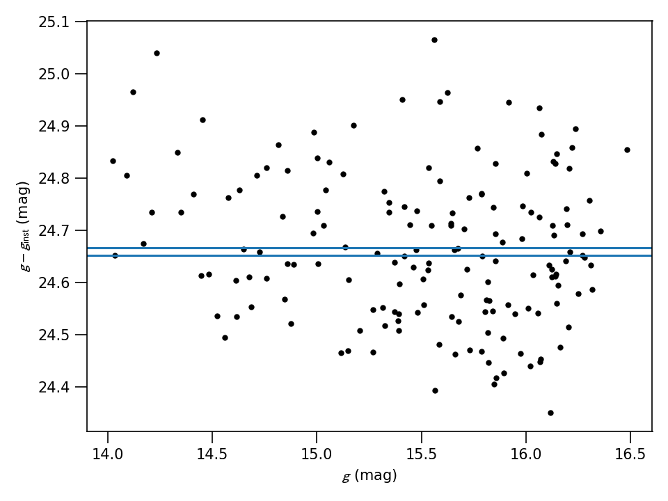

# calviacat v1.1.1
Calibrate star photometry by comparison to a catalog.  PanSTARRS 1, ATLAS-RefCat2, and SkyMapper catalogs currently implemented.  Catalog queries are cached so that subsequent calibrations of the same or similar fields can be more quickly executed.

## Attribution and license

calviacat is written by Michael S. P. Kelley, with contributions from: Tim Lister.  It is licensed with the MIT License (see LICENSE for details).

Kelley, Michael S. P. & Lister, Tim. 2019.  mkelley/calviacat: v1.0.2.  DOI: 10.5281/zenodo.2635841

[](https://doi.org/10.5281/zenodo.2635841)

## Requirements

* sqlite3
* requests
* astropy, v3 or later
* astroquery
* [mastcasjobs](https://github.com/rlwastro/mastcasjobs) for ATLAS-RefCat2

## Examples

See the `examples/` directory for example scripts that calibrate Las
Cumbres Observatory images of 41P/Tuttle-Giacobini-Kresak.

## PanSTARRS catalog with color correction

``` python
ps1 = PanSTARRS1('cat.db')
ps1.fetch_field(lco)
objids, distances = ps1.xmatch(lco)
zp, C, unc, g, gmr, gmi = ps1.cal_color(objids, g_inst, 'g', 'g-r')
```


The color correction slope may also be held fixed with the `C` parameter:

``` python
zp, C, unc, g, gmr, gmi = ps1.cal_color(objids, g_inst, 'g', 'g-r', C=-0.089)
```

## SkyMapper catalog without color correction

No r-band coverage in DR1 for the example image, so just calibrate to g without a color correction.

``` python
skym = cvc.SkyMapper('cat.db')
skym.fetch_field(lco)
objids, distances = skym.xmatch(lco)
zp_mean, zp_median, unc, g, gmi = skym.cal_constant(objids, g_inst, 'g')
```



## ATLAS-RefCat2

ATLAS-RefCat2 queries are executed with MAST CASJOBS, and therefore requires your MAST WSID (from <http://mastweb.stsci.edu/ps1casjobs/changedetails.aspx> after you login to Casjobs).  They may also come from the CASJOBS_WSID and CASJOBS_PW environment variables.

With RefCat2, we can calibrate the last example using a color correction:


``` python
rc2 = cvc.RefCat2('cat.db')
rc2.fetch_field(lco)
objids, distances = rc2.xmatch(lco)
zp, C, unc, g, gmr, gmi = rc2.cal_color(objids, g_inst, 'g', 'g-r')
```


## Acknowledgements

Development of this code was supported by the NASA Solar System Observations program, grant NNX15AD99G.

The PS1 archive is hosted at STScI.  Cite Chambers et al. 2016 (https://ui.adsabs.harvard.edu/#abs/arXiv:1612.05560) and acknowledge the Pan-STARRS 1 survey, as needed.  See https://panstarrs.stsci.edu/ for details.

The SkyMapper archive is hosted at the All-Sky Virtual Observatory (AVSO) node of the National Computational Infrastructure (NCI) site.  See http://skymapper.anu.edu.au/policies/authorship/ and http://nci.org.au/services/virtual-laboratories/all-sky-virtual-observatory/ .

ATLAS-RefCat2 is hosted at STScI, [DOI 10.17909/t9-2p3r-7651](http://dx.doi.org/10.17909/t9-2p3r-7651).  Also cite Tonry et al. 2018 (https://ui.adsabs.harvard.edu/abs/2018ApJ...867..105T/abstract).

The Pan-STARRS1 Surveys (PS1) and the PS1 public science archive have been made possible through contributions by the Institute for Astronomy, the University of Hawaii, the Pan-STARRS Project Office, the Max-Planck Society and its participating institutes, the Max Planck Institute for Astronomy, Heidelberg and the Max Planck Institute for Extraterrestrial Physics, Garching, The Johns Hopkins University, Durham University, the University of Edinburgh, the Queen's University Belfast, the Harvard-Smithsonian Center for Astrophysics, the Las Cumbres Observatory Global Telescope Network Incorporated, the National Central University of Taiwan, the Space Telescope Science Institute, the National Aeronautics and Space Administration under Grant No. NNX08AR22G issued through the Planetary Science Division of the NASA Science Mission Directorate, the National Science Foundation Grant No. AST-1238877, the University of Maryland, Eotvos Lorand University (ELTE), the Los Alamos National Laboratory, and the Gordon and Betty Moore Foundation.

The national facility capability for SkyMapper has been funded through ARC LIEF grant LE130100104 from the Australian Research Council, awarded to the University of Sydney, the Australian National University, Swinburne University of Technology, the University of Queensland, the University of Western Australia, the University of Melbourne, Curtin University of Technology, Monash University and the Australian Astronomical Observatory. SkyMapper is owned and operated by The Australian National University's Research School of Astronomy and Astrophysics. The survey data were processed and provided by the SkyMapper Team at ANU. The SkyMapper node of the All-Sky Virtual Observatory (ASVO) is hosted at the National Computational Infrastructure (NCI). Development and support the SkyMapper node of the ASVO has been funded in part by Astronomy Australia Limited (AAL) and the Australian Government through the Commonwealth's Education Investment Fund (EIF) and National Collaborative Research Infrastructure Strategy (NCRIS), particularly the National eResearch Collaboration Tools and Resources (NeCTAR) and the Australian National Data Service Projects (ANDS).
